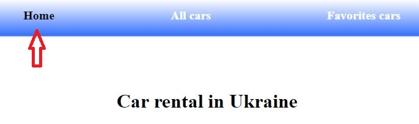
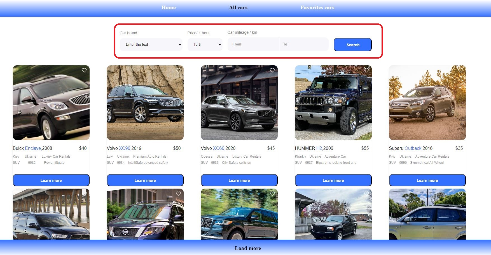
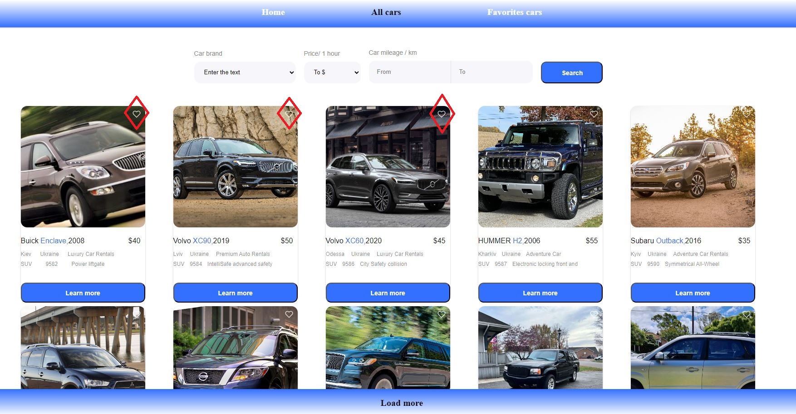

<h1 align="center" style="color: #3470ff">Car Rental Organaizer</h1>

<h4 align="center" style="color: #3470ff">be move like you want
</h4>

  

<h3 align="center" style="color: #3470ff">The service provides an opportunity to choose and order a car rental
</h3>

 The first independent project of a beginner student 

<h4 style="color: red">need fix some and add features</h4>

add filter logig

add redux to some components for  fix

---

# Frontend

---

<h4>To navigate use pages on the top</h4>

---

<h4>Use for filtering offers </h4>
(under development)

---

<h4>Use to mark the chosen for Favorites cars page </h4>

---

# Link to the service

[go to service ](https://morskoysom.github.io/car-rental/)

---
